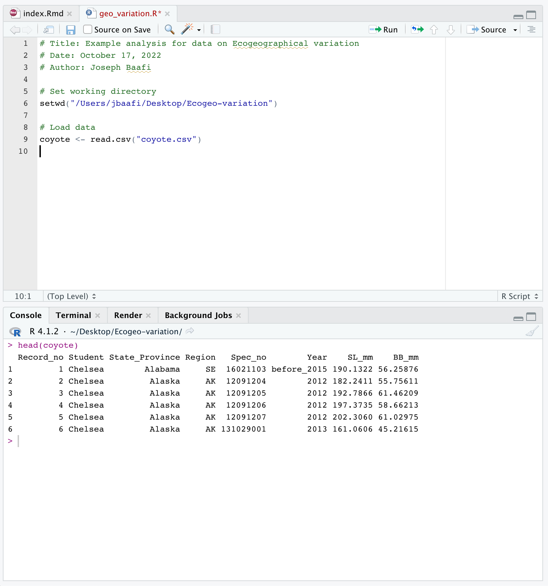
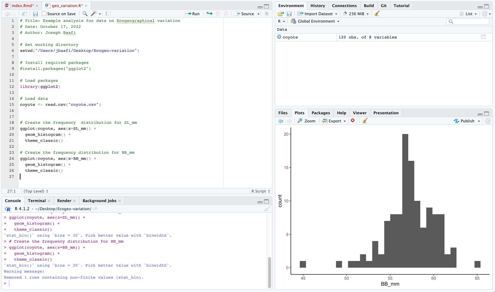

# Getting started and Learning R

If you have not used `R` previously, we recommend that you work through *Chapters 1 to 10* of the [Quantitative training guide](https://ahurford.github.io/quant-guide-all-courses/), which includes instructions on how to install `R` on a computer and the basics on coding in R.

In particular, in this lab you will work with the commands for [Handling data using R](https://ahurford.github.io/quant-guide-all-courses/handling-data.html#base-r) and [Making graphs in R](https://ahurford.github.io/quant-guide-all-courses/graph.html). You will also learn how to perform [statistical analyses in R](https://ahurford.github.io/quant-guide-all-courses/statistics.html).


# How to examine and analyze the data in R

## Data importation and examination

To learn more about the codes being used in this section, we recommend you read through *Chapters 8 and 9* of the [Quantitative training guide](https://ahurford.github.io/quant-guide-all-courses/) where each line of code has been clearly explained.

1.  Begin by making a folder on your D: drive (if you are working in a university computer lab), or on your Desktop (if you are working on your own computer), where you will work on this assignment.

2. Download the data from D2L and save it as a `.csv` file to the folder you made on the D: drive (or your Desktop).  You may rename the `.csv` file you downloaded as `coyote.csv`. 

3. Open R Studio and save a new R Script. In the top menu select `File > New File > R Script`, then `File > Save As`. Save the `.R` (the R Script) to the folder you made on your D: drive (or Desktop). It is very important to save both of these files in the same folder. 

4. Now you can load your data by running the following command:

```{r,results=FALSE}
coyote <- read.csv(file = "coyote.csv")
```

The above command is essential to your analysis so you should add it to your R Script. Your R Script should look something like this:

```{r,out.width="80%",echo=F}

```

The values in your dataset might look different from what I have in this dataset. Note that this is just a sample data to guide you through the analysis. 


5. You can explore the data using the following commands. This is an important practice to ensure that your data is loaded. 
```{r}
head(coyote)
```

```{r}
str(coyote)
```

To list the names of the columns of the data:
```{r}
names(coyote)
```

Note that the commands to explore the data are good to run in the `Console` because we want to have a general knowledge of how the data looks like:  These commands act as query rather than an essential part of the analysis.

6. If your data has not loaded, the most likely problem is a spelling error or problems with specifying the [path](https://ahurford.github.io/quant-guide-all-courses/rintro.html#working-directory) to `coyote.csv`. You might try:

-   the [RStudio way](https://ahurford.github.io/quant-guide-all-courses/data-entry.html#the-rstudio-way-the-import-feature) of importing your data, or

-   moving `coyote.csv` to your [working directory](https://ahurford.github.io/quant-guide-all-courses/rintro.html#working-directory). To find out your working directory type `getwd()` into your Console:


```{r}
getwd()
```

For more help on resolving problems with loading data and setting your working directory you can read through *section 2.1* of [this study guide.](https://ahurford.github.io/BIOL4650-marine_conservation/how-to-do-the-analysis-in-r.html)


# Making graphs

Before we can make the graphs we will need to install and load the necessary packages. 

1. First, we would have to install the package `ggplot2`. To do this, we will run the following code 
```{r, eval=FALSE}
install.packages("ggplot2")
```

2. Now we load the installed package into `R` by running the code
```{r}
library(ggplot2)
```

3. Now that the required package has been installed and loaded, we are going to create the frequency distribution of each variable. The distribution for SL_mm is produced by running the following code:

```{r}
ggplot(coyote, aes(x=SL_mm)) +
  geom_histogram() +
  theme_classic()
```

4. We can also create the frequency distribution for BB_mm by running the following code:
```{r}
ggplot(coyote, aes(x=BB_mm)) +
  geom_histogram() +
  theme_classic()
```

These lines of code are very important to the analysis so you would want to add them as the next lines of code in your R Script. At this stage your R script will look like this:

```{r,out.width="85%",echo=F}

```


5. Now we create a scatter plot of the two variables (SL_mm and BB_mm) using the following code. 

```{r}
ggplot(coyote, aes(x = SL_mm, y = BB_mm)) + 
  geom_point(size = 2) + 
  theme_classic() +
  xlab("Skull length") + 
  ylab("Braincase breadth")
```

On this scatter plot, we show the relationship between the `SL_mm` and `BB_mm` by treating `BB_mm` as a function of `SL_mm`.

6. If you have outliers in your data and you wish to remove them you can do so using the following code. Replace `spec no. of the outlier of your data` in the code with the actual spec number of your data.

```{r, eval=FALSE}
coyote <- coyote %>% filter(Spec_no != "spec no. of the outlier of your data")
```


# Making tables

Before we make the tables we will need to install and load the necessary packages. The package needed to manipulate data and create dataframe is the `dplyr` package.


1. To help us compute the descriptive statistics of the data, we will need to install the `dplyr` package. The following code will help you to install this package. You may skip this step if you have already installed the package. 

```{r, eval=FALSE}
install.packages("dplyr")
```

2. After successful installation, we will have to load it into R using the code

```{r, message=FALSE}
library(dplyr)
```

3. Now we are good to manipulate the data and create data frames. The first dataframe gives a descriptive statistics (summary) of the skull length (SL_mm) by region. 

```{r}
coyoteSL <- coyote %>% filter(!is.na(coyote$SL_mm))
as.data.frame(summarize(group_by(coyoteSL, Region), SL_mean = mean(SL_mm),
                  SL_SD = sd(SL_mm), n = n()))
```

4. The overall mean and standard deviation of the skull length and the number of skulls can be found by running this code:

```{r}
as.data.frame(summarize(group_by(coyoteSL), SL_mean = mean(SL_mm),
                  SL_SD = sd(SL_mm), n = n()))
```
5. We can also create a dataframe that gives a summary of the braincase breadth (BB_mm) by region. This is done by running the code:

```{r}
coyoteBB <- coyote %>% filter(!is.na(coyote$BB_mm))
as.data.frame(summarize(group_by(coyoteBB, Region), BB_mean = mean(BB_mm),
                  BB_SD = sd(BB_mm), n = n()))
```
6. The overall mean and standard deviation of the braincase breadth (BB_mm) and the number of skulls measured can be found by running this code:

```{r}
as.data.frame(summarize(group_by(coyoteBB), BB_mean = mean(BB_mm),
                  BB_SD = sd(BB_mm), n = n()))
```

# Geographic variation in coyote skulls

There are many ways to test for geographic differences statistically. In this lab, we will test for differences between


(a) AK and the rest of the samples; 

(b) NW and NE; and 

(c) NW and SW.

First we will visualize the data in separate boxplots for each variable, with one box for each of the five regions. We create the boxplots using the `ggplot()` function. If you have not used `ggplot` previously, we recommend that you work through a guide on how to make plots with [ggplot](https://ahurford.github.io/quant-guide-all-courses/ggplot.html#making-scatter-plots-with-ggplot2).

1. The following code creates a boxplot with skull length as a function of region (in other words, the boxplot shows the skull length for each region).

```{r}
ggplot(coyote, aes(x = Region, y = SL_mm)) + geom_boxplot()+ 
 	 theme_classic() + ylab("Skull length")
```

2. We also create a boxplot with braincase breadth as a function of region (the boxplot shows the braincase breadth for each region). 

```{r}
ggplot(coyote, aes(x = Region, y =BB_mm)) + geom_boxplot()+ 
  theme_classic() + ylab("Braincase breadth")
```

## Analysis of variance (ANOVA)

Analysis of Variance (ANOVA) is a statistical test to determine whether two or more population means are different. There are several versions of the ANOVA e.g., one-way ANOVA, two-way ANOVA, etc.

In this section, we conduct one-way ANOVA on the comparisons for both variables (that is the skull length and the braincase breadth) and summarize the results in tables.

1. We first do the comparison for the SL_mm variable. We add a a variable `GroupsAKRest` to the data where all other regions apart from `AK` is taken as `others`.

```{r, results=F}
coyoteA <- mutate(coyote, GroupsAKRest = ifelse(Region == "AK", "AK", "Others"))
coyoteA
```

2. Now we define a model with `SL_mm` as a function of `GroupsAKRest`.
```{r}
modelSL<- lm(SL_mm~GroupsAKRest, data = coyoteA)
```

Now to get the details of the model described in the previous line, we will have to use the `summary()` function

```{r}
summary(modelSL)
```

3. At this point we can do the analysis of variance for AK and the rest of the regions. The ANOVA table can be found by running the code:
```{r}
anova(modelSL)
```

4. We can replace `SL_mm` by `BB_mm` to do a similar comparison in the braincase breadth for `AK` and the other regions. Let me call this `modelBB`.
```{r}
modelBB <- lm(BB_mm~GroupsAKRest, data = coyoteA )
```

To get details of `modelBB` we use the `summary()` function

```{r}
summary(modelBB)
```

5. The ANOVA table can be found by running the code:
```{r}
anova(modelBB)
```

6. We also conduct the ANOVA for NW and NE in a similar manner as was done above.
We would have to filter the `coyote` data using the `filter()` function in the `dplyr` package to select the `NW` and `NE` regions. We will save this data as `coyoteNW_NE`.
```{r}
coyoteNW_NE <- coyote %>% filter(Region == "NW" | Region == "NE")
```

7. Now we define a model `SL_mm` as a function of the two regions `NW` and `NE`. Let us call this `modelSL1` to different it from the previous model.
```{r}
modelSL1 <- lm(SL_mm~Region, data = coyoteNW_NE)
summary(modelSL1)
```

8. The Anova table for `modelSL1` can also be obtained:
```{r}
anova(modelSL1)
```

9. We do a similar model for `BB_mm` with the two regions `NW` and `NE`. Let us call this `modelBB1` to different it from the previous model. 
```{r}
modelBB1<- lm(BB_mm~Region, data = coyoteNW_NE )
summary(modelBB1)
```

10. The Anova table for `modelBB1` can also be obtained by the code:
```{r}
anova(modelBB1)
```

11.Now we want to do the comparison for NW and SW.
We would have to filter the data using the `filter()` function in `dplyr` to select the `NW` and `SW` regions. Let us save this data as `coyoteNW_SW`. 

```{r}
coyoteNW_SW <- coyote %>% filter(Region == "NW" | Region == "SW")
```

12. We define a model for `SL_mm` with the regions being `NW` and `SW`. Let us call this model `modelSL2`. 
```{r}
modelSL2 <- lm(SL_mm ~Region, data = coyoteNW_SW )
summary(modelSL2)
```

13. The Anova table for `modelSL2` can be obtained by running this code:
```{r}
anova(modelSL2)
```

14. We again define a model for `BB_mm`. Let us call this model `modelBB2`. 
```{r}
modelBB2<- lm(BB_mm ~Region, data = coyoteNW_SW )
summary(modelBB2)
```

15. The Anova table for `modelBB2` can be obtained by running this code:
```{r}
anova(modelBB2)
```


